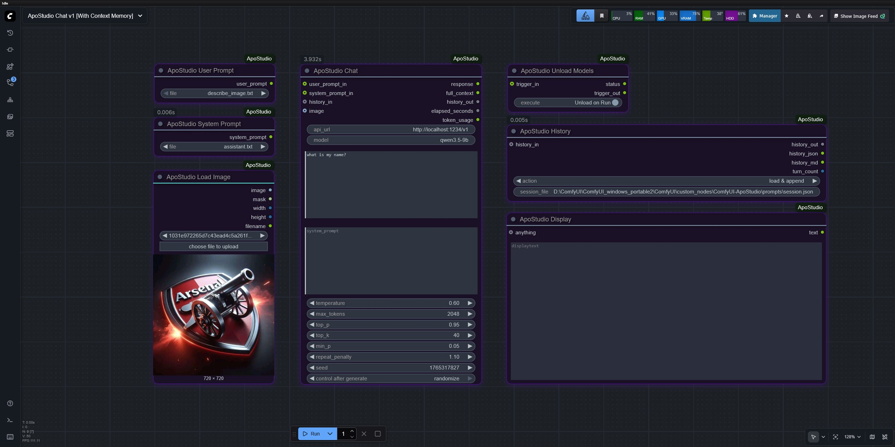
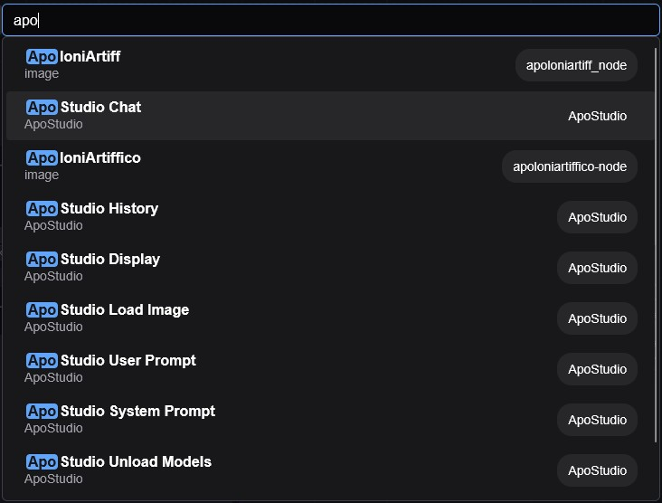
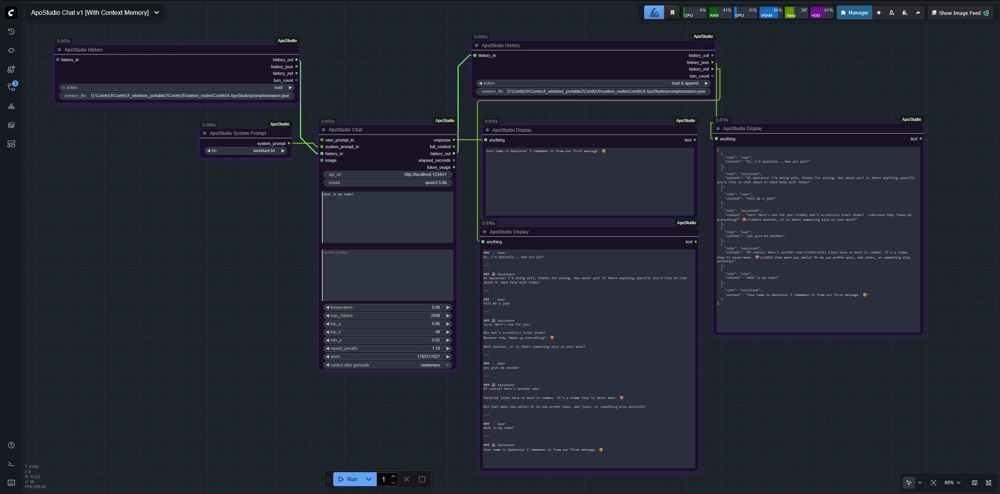
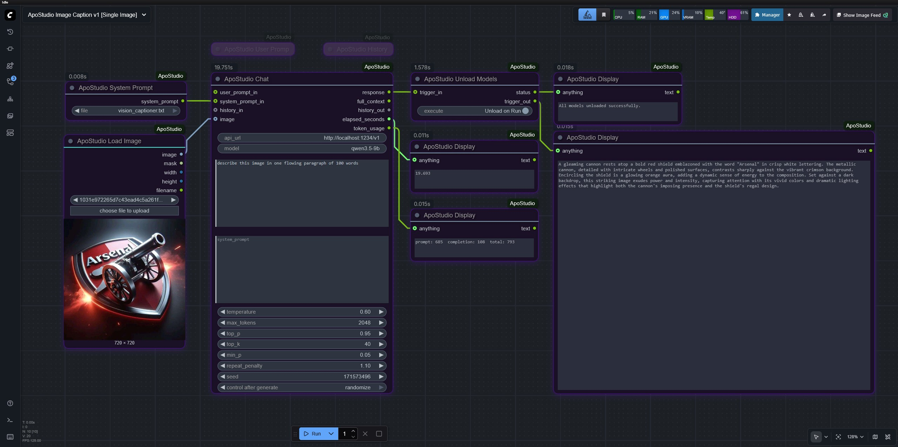

[](https://www.paypal.com/donate/?hosted_button_id=MG5S4EPK6EUSL)
# ApoStudio

**ComfyUI custom node package for LLM-powered workflows.**

Chat, prompt enhancement, image captioning, and multi-turn conversation via any **OpenAI-compatible** server — LM Studio, Ollama, OpenAI API, and more.



---

## Finding ApoStudio Nodes

Double-click the ComfyUI canvas and search **"apo"** to find all nodes instantly.



---

## Example Workflows

### Chat with Context Memory
Full multi-turn conversation with persistent history across workflow runs.



### Image Captioning
Single image captioning using a vision model.



---

## Node Reference

### ApoStudio Chat
The core node. Sends a prompt to your LLM server and returns the response. Handles text-only, vision, and multi-turn conversation depending on what is connected.

**Required inputs**
| Input | Type | Default | Notes |
|-------|------|---------|-------|
| `api_url` | STRING | `http://localhost:1234/v1` | OpenAI-compatible endpoint |
| `model` | STRING | `enter-model-id-here` | Exact model ID as shown in your server |
| `user_prompt` | STRING | _(empty)_ | Typed user message. Overridden if `user_prompt_in` is connected |
| `system_prompt` | STRING | _(empty)_ | Typed system prompt. Overridden if `system_prompt_in` is connected |
| `temperature` | FLOAT | 0.7 | 0.0 – 2.0. Higher = more creative, lower = more deterministic |
| `max_tokens` | INT | 2048 | Maximum response length |
| `top_p` | FLOAT | 0.95 | Nucleus sampling threshold |
| `top_k` | INT | 40 | Top-K sampling |
| `min_p` | FLOAT | 0.05 | Minimum probability threshold |
| `repeat_penalty` | FLOAT | 1.1 | Penalises repetition. 1.0 = off |
| `seed` | INT | -1 | -1 = random each run |

**Optional inputs**
| Input | Type | Notes |
|-------|------|-------|
| `user_prompt_in` | STRING | From User Prompt node — overrides typed text |
| `system_prompt_in` | STRING | From System Prompt node — overrides typed text |
| `history_in` | APO_HISTORY | Conversation history from a History node (load action) |
| `image` | IMAGE | Connect any IMAGE for vision/captioning tasks |

**Outputs**
| Output | Type | Notes |
|--------|------|-------|
| `response` | STRING | The LLM's reply text |
| `full_context` | STRING | Full message array sent to API as JSON — useful for debugging |
| `history_out` | APO_HISTORY | Updated conversation history — wire to History node (load & append) |
| `elapsed_seconds` | FLOAT | Response time in seconds |
| `token_usage` | STRING | `prompt: X  completion: Y  total: Z` |

**Supported input combinations**

| What you connect | What happens |
|-----------------|--------------|
| User prompt only | Sends as a plain user message |
| System prompt only | Model responds to the system prompt directly |
| Both prompts | System sets context/role, user carries the request |
| Image only | Model describes the image |
| Image + user text | Image with a specific instruction |
| Image + system prompt | System sets role, image is the user message |
| All three | Full vision task with role, instruction, and image |

---

### ApoStudio User Prompt
File picker for user prompts. Reads `.txt`, `.md`, and `.json` files from the `prompts/user/` folder inside the package directory. Drop your own files into that folder — the dropdown refreshes automatically on every run without restarting ComfyUI.

For `.json` files, the node extracts the value of the first matching key it finds: `prompt`, `user_prompt`, `content`, `text`, or `message`. If none match, the full JSON is returned as a string.

**Input:** `file` dropdown  
**Output:** `user_prompt` STRING → wire to Chat's `user_prompt_in`

**Tip:** Leave the Chat node's `user_prompt` text area empty when using this node — the connected input takes priority automatically.

---

### ApoStudio System Prompt
Identical to User Prompt but reads from `prompts/system/`. Use this to load different roles and personas without retyping them.

Ships with three ready-to-use system prompts:
- **`assistant.txt`** — general-purpose helpful assistant
- **`vision_captioner.txt`** — detailed image analysis for captioning and description tasks
- **`prompt_enhancer.txt`** — expands rough ideas into full, detailed diffusion model prompts

**Input:** `file` dropdown  
**Output:** `system_prompt` STRING → wire to Chat's `system_prompt_in`

---

### ApoStudio History
Manages multi-turn conversation history by reading from and writing to a JSON session file on disk. Because ComfyUI cannot loop data within a single run, history is persisted between runs via the file system.

**How it works:** One History node loads the previous session at the start of each run. Another History node saves the updated session after Chat completes. Both nodes point to the same session file.

**Inputs**
| Input | Type | Notes |
|-------|------|-------|
| `action` | Dropdown | See actions table below |
| `session_file` | STRING | Full path to your session JSON file, e.g. `C:/chats/session.json` |
| `history_in` | APO_HISTORY | Wire Chat's `history_out` here on the save-side node |

**Actions**
| Action | Which node | What it does |
|--------|-----------|--------------|
| `load` | Left node (before Chat) | Reads history from the session file and outputs it to Chat's `history_in` |
| `load & append` | Right node (after Chat) | Receives Chat's `history_out`, saves the full updated conversation to the session file |
| `clear` | Either node | Deletes the session file and resets history to empty. Run once then switch back |
| `save` | Either node | Manually saves incoming history to the session file without loading |

**Outputs**
| Output | Type | Notes |
|--------|------|-------|
| `history_out` | APO_HISTORY | Wire left node's output to Chat's `history_in` |
| `history_json` | STRING | Full conversation as raw JSON — wire to Display for debugging |
| `history_md` | STRING | Full conversation formatted as readable Markdown — wire to Display for reading |
| `turn_count` | INT | Number of completed assistant replies in the current session |

**Wiring for multi-turn chat:**
```
[History: load] ──history_out──► Chat (history_in)
                                  Chat (history_out) ──► [History: load & append]
                                  Chat (response) ──► Display
                [History: load & append] ──history_md──► Display (full conversation)
```

**Starting a fresh conversation:** Switch the right History node action to `clear`, run once, then switch back to `load & append`. The session file will be deleted and history resets.

**Important:** Both History nodes must point to the exact same `session_file` path.

---

### ApoStudio Unload Models
Unloads all models from VRAM using the LM Studio CLI (`lms unload --all`). Wire it after your Chat node to automatically free VRAM at the end of a workflow run. Use the execute toggle to quickly disable it without disconnecting anything.

**Inputs**
| Input | Type | Notes |
|-------|------|-------|
| `execute` | BOOLEAN | `Unload on Run` / `Skip` — toggle off when iterating quickly |
| `trigger_in` | STRING (optional) | Wire Chat's `response` here to ensure it runs after Chat completes |

**Outputs**
| Output | Type | Notes |
|--------|------|-------|
| `status` | STRING | CLI result message — wire to Display to confirm unload |
| `trigger_out` | STRING | Passes `trigger_in` through — wire to Display to close the execution chain |

**Wiring:**
```
Chat (response) ──► Unload (trigger_in) ──trigger_out──► Display
```

> **Note:** Requires the LM Studio CLI (`lms`) installed and available on your system PATH. This node is specific to LM Studio and will not work with other servers.

---

### ApoStudio Display
Universal display node. Accepts any input type and renders it as readable text directly in the node body after each run. Replaces the need for third-party Show Any nodes within ApoStudio workflows.

Wire any output from any node into `anything` — STRING, FLOAT, INT, APO_HISTORY, lists, or dicts are all handled. Lists and dicts are formatted as readable JSON automatically.

**Input:** `anything` — accepts any type  
**Output:** `text` STRING — passes the displayed text downstream for chaining

---

### ApoStudio Load Image
Image loader with a file picker for your ComfyUI `input/` directory. Supports jpg, jpeg, png, webp, bmp, tiff, and gif (first frame only). Includes EXIF orientation auto-correction so rotated phone photos load upright.

**Input:** `image` dropdown + "choose file to upload" button  
**Outputs**
| Output | Type | Notes |
|--------|------|-------|
| `image` | IMAGE | Tensor ready to wire into Chat's `image` input |
| `mask` | MASK | Alpha channel as mask, or solid white if no alpha |
| `width` | INT | Image width in pixels |
| `height` | INT | Image height in pixels |
| `filename` | STRING | Base filename of the loaded image |

---

## Installation

### 1. Clone or download

```bash
cd ComfyUI/custom_nodes
git clone https://github.com/yourusername/ApoStudio
```

Or download the ZIP and extract so the folder is at `ComfyUI/custom_nodes/ApoStudio/` (or any name — the package works regardless of folder name).

### 2. Install dependencies

**Windows portable install:**
```bat
python_embeded\python.exe -m pip install -r custom_nodes\ApoStudio\requirements.txt
```

**Standard install:**
```bash
pip install -r custom_nodes/ApoStudio/requirements.txt
```

Dependencies (`requests`, `Pillow`) also auto-install on first ComfyUI startup.

### 3. Restart ComfyUI

You should see in the terminal:
```
[ApoStudio] Loaded — 7 nodes registered.
```

All nodes appear under the **ApoStudio** category. Search **"apo"** in the node finder to see them all.

---

## Adding your own prompt files

Drop `.txt`, `.md`, or `.json` files into:
- `prompts/user/` — for user prompts
- `prompts/system/` — for system prompts

Files appear in the dropdown on the next workflow run. No restart needed.

**JSON format:** Any JSON file with one of these keys will have its value extracted automatically: `prompt`, `user_prompt`, `system_prompt`, `content`, `text`, `message`.

---

## Server compatibility

| Server | Default URL |
|--------|------------|
| LM Studio | `http://localhost:1234/v1` |
| Ollama | `http://localhost:11434/v1` |
| OpenAI API | `https://api.openai.com/v1` |
| LiteLLM / vLLM / text-generation-webui | Set your own URL |

> The **Unload Models** node uses LM Studio's CLI and is LM Studio-specific. All other nodes work with any OpenAI-compatible server.

---

## File structure

```
ApoStudio/
├── __init__.py                      ← Package entry point, node registration
├── requirements.txt                 ← pip dependencies (requests, Pillow)
├── pyproject.toml                   ← ComfyUI Registry metadata
├── README.md                        ← This file
├── CHANGELOG.md                     ← Version history
├── LICENSE                          ← MIT licence
├── assets/
│   └── screenshots/
│       ├── ApoStudio-Nodes.jpg      ← Node collection overview
│       ├── ApoStudio-Chatv1.jpg     ← Chat workflow with context memory
│       ├── ApoStudio-ImageCaption.jpg ← Image captioning workflow
│       └── ApoStudio-Search.jpg     ← How to find nodes in ComfyUI
├── nodes/
│   ├── __init__.py                  ← Package marker
│   ├── apo_chat.py                  ← ApoStudio Chat
│   ├── apo_history.py               ← ApoStudio History
│   ├── apo_prompts.py               ← ApoStudio User Prompt & System Prompt
│   ├── apo_unload.py                ← ApoStudio Unload Models
│   ├── apo_display.py               ← ApoStudio Display
│   └── apo_load_image.py            ← ApoStudio Load Image
├── prompts/
│   ├── user/
│   │   ├── describe_image.txt       ← Example: image description prompt
│   │   └── enhance_prompt.txt       ← Example: diffusion prompt enhancer
│   └── system/
│       ├── assistant.txt            ← General-purpose assistant
│       ├── vision_captioner.txt     ← Image analysis and captioning
│       └── prompt_enhancer.txt      ← Diffusion model prompt expansion
└── web/
    └── js/
        └── apo_display.js           ← Frontend JS for Display node rendering
```

---

## Publishing to the ComfyUI Registry

1. Create an account at [registry.comfy.org](https://registry.comfy.org) and get your Publisher ID
2. Fill in `PublisherId` in `pyproject.toml`
3. Push your repo to GitHub (public)
4. Get an API key from registry.comfy.org → API Keys
5. Add it as a GitHub secret named `REGISTRY_ACCESS_TOKEN`
6. Add `.github/workflows/publish.yml` (see CHANGELOG for template)
7. Bump `version` in `pyproject.toml` and push to trigger auto-publish

---

## License

MIT — see `LICENSE`.
